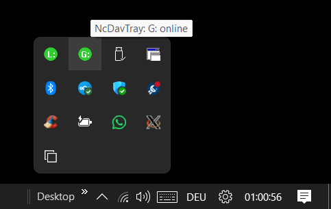
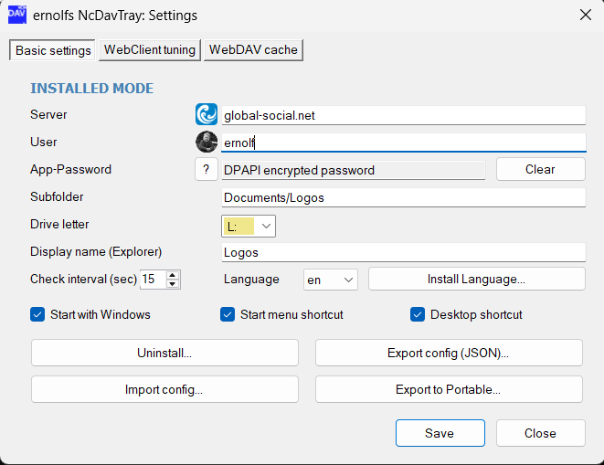
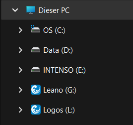
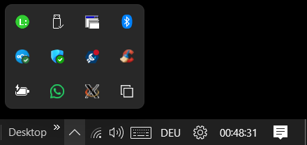
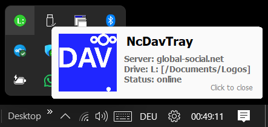
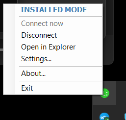
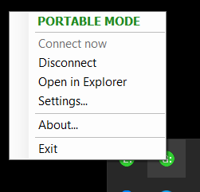
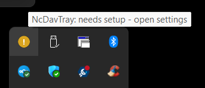
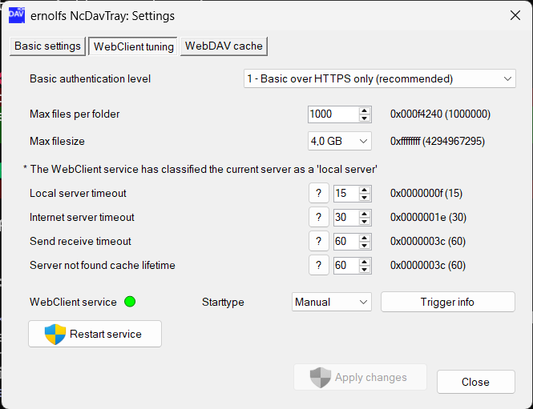
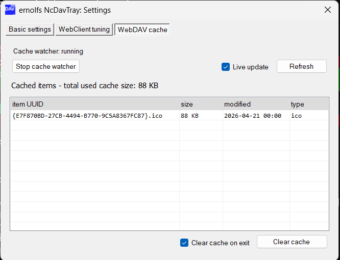

<!-- Project header -->

  
  <h3>NcDavTray — Tiny Nextcloud WebDAV Tray for Windows</h3>
  
Windows WebDAV tray watcher + watchdog (PowerShell 5.1 + WinForms)

  

    
    
    
  

 

Map your Nextcloud server to a real Windows drive letter (e.g. `Z:`) and keep it healthy. NcDavTray is a small, self‑contained tray app written in **Windows PowerShell 5.1 + WinForms** with a small amount of embedded C# for DPI and shell notifications. It runs without admin rights and supports both **Installed** and **Portable** modes.

---

## Features

* **One‑click drive mapping** to a persistent letter (your choice)
* **Auto‑reconnect & watchdog** — if the server goes offline or into maintenance mode the tray icon turns red and the drive is cleanly unmapped; as soon as the server is back the drive remounts automatically
* **Optional subfolder mapping** — map any folder within your Nextcloud, not just the root
* **Friendly Explorer appearance** — custom drive label and icon pulled from your Nextcloud favicon
* **Tray UI**: connect/disconnect (pause), status balloon, Settings, About, Exit
* **Two security models**:
  * **Installed**: credentials protected with Windows **DPAPI** (bound to your Windows user profile)
  * **Portable**: credentials encrypted with **AES‑256‑CBC + PBKDF2** (100 000 iterations, passphrase you choose)
* **Automatic file locking for Office apps** — Office applications (Microsoft 365, LibreOffice, Collabora …) lock files automatically via WebDAV when opened from the drive. With the optional [`files_lock`](https://apps.nextcloud.com/apps/files_lock) server app, non-Office files are locked too. **This works on an NcDavTray network drive and does not work with the official Nextcloud Desktop Client.**
* **Watchdog process** for clean unmount if the main app crashes or a USB stick (portable mode) disappears
* **WebClient tuning tab** — inspect and adjust Windows WebDAV redirector (WebClient) limits and timeouts with safe defaults, inline help texts, and a UAC-guarded *Apply changes* button
* **WebDAV cache tab** — monitor the WebClient cache in real time, view cached items, clear them manually or auto-wipe on watcher exit
* **Multi‑language (i18n)** with live switching (no restart) and simple JSON language packs

---

## Requirements

* **Windows 10 / 11** with **Windows PowerShell 5.1** (the provided launcher starts PS 5.1 in STA mode automatically)
* **WebClient** service (Windows WebDAV mini‑redirector) — enabled and set to *Manual* or *Automatic*
* **Nextcloud** reachable via **HTTPS** using a **Nextcloud App Password**

No administrator permissions are required except for the optional WebClient service handling and the cache watcher.

---

## Install & Quick Start

1. **Download the latest ZIP** from the [Releases](https://github.com/ernolf/NcDavTray/releases) page.
2. **Extract** the ZIP to a folder inside your user profile.
3. **Run** `installNcDavTray.cmd` and choose:

   * **1 — Installed mode**: copies the app into `%LOCALAPPDATA%\NcDavTray`, sets optional per‑user auto‑start, creates Start Menu / Desktop shortcuts, and safely stops + restarts any running instance while preserving your config.
   * **2 — Portable mode**: creates a self‑contained portable package in the selected folder. Launch via the generated `Start NcDavTray.cmd`.

Multiple instances can run side by side — one installed and any number of portable mounts, even from different Nextcloud accounts:

**First run:** open **Settings** from the tray icon, enter:

| Field | Notes |
|---|---|
| **Server** | Host only, e.g. `cloud.example.com` |
| **User** | Your Nextcloud user ID |
| **App password** | Create in Nextcloud → *Profile → Security*; used for WebDAV only |
| **Subfolder** | Optional — pick via the built-in folder browser |
| **Drive letter** | Next free letter is pre‑selected |
| **Display name** | Label shown in Explorer (auto‑suggested from subfolder / user) |
| **Language** | Auto‑detected or pick from installed language packs |
| **Check interval** | How often the watchdog polls (seconds) |

Click **Save** → NcDavTray maps the drive, applies the icon and label, and keeps it online.

  
  &nbsp;
  

---

## Using the tray

| Action | Effect |
|---|---|
| **Left‑click** | Status balloon (server · drive · subpath · state) |
| **Right‑click → Connect** | Map drive / resume after pause |
| **Right‑click → Disconnect** | Unmap and pause auto-reconnect |
| **Right‑click → Open in Explorer** | Opens the mapped drive |
| **Right‑click → Settings** | Open the Settings dialog |
| **Right‑click → Exit** | Clean unmount + exit |

  
  &nbsp;
  

  
  &nbsp;
  
  &nbsp;
  

---

## File locking

NcDavTray exposes Nextcloud storage as a standard Windows network drive. Because of this, **Office applications** (Microsoft 365, LibreOffice, Collabora and others) open a direct WebDAV connection to the server and issue a `LOCK` request automatically before editing any file. This means:

* **Automatic, per-application file locking works out of the box** — no extra configuration required.
* Another user attempting to open the same file sees the standard Office "file is locked by another user" warning.
* When the application closes the file, the lock is released automatically.

> **This automatic locking does not work with the official Nextcloud Desktop Client** (sync client / virtual files). The Desktop Client synchronises files locally and does not send WebDAV `LOCK` requests when an application opens a synced file.

### With the `files_lock` app

When the Nextcloud **[`files_lock`](https://apps.nextcloud.com/apps/files_lock)** app is installed on the server, locking is extended further:

* **Non-Office files are also locked** when opened through NcDavTray — any application that opens a file over the WebDAV drive triggers a server-side lock.
* The Desktop Client gains a **manual lock/unlock** option in the file context menu.
* The server enforces locks (HTTP 423) towards other users.

> **Known limitation (files_lock issue [#228](https://github.com/nextcloud/files_lock/issues/228)):** The same user who created a lock can bypass it — they can still edit, rename, move, or delete the file. Locking is therefore effective for multi-user collaboration but does not protect a file from the user who locked it.

### Comparison

NcDavTray and the official Desktop Client are fully complementary:

| | NcDavTray (WebDAV drive) | Nextcloud Desktop Client |
|---|---|---|
| Automatic Office file locking | ✅ | ❌ |
| Non-Office file locking (requires `files_lock`) | ✅ | ❌ |
| Manual lock via context menu (requires `files_lock`) | ❌ | ✅ |
| Offline / sync capability | ❌ | ✅ |
| Works like a standard network drive | ✅ | — |

Using both together gives you the best of both worlds.

---

## Tuning the WebClient service

The **WebClient tuning** tab in Settings exposes the most relevant registry settings of the Windows WebDAV redirector in a safe, documented way:

* Maximum number of files per folder (attribute cache limit)
* Maximum file size (up to 4 GB)
* Local / internet server timeouts
* Send/receive timeout
* *Server not found* cache lifetime
* Start / restart the service
* Service startup type (Disabled, Manual, Automatic)

All values show both the **current registry value** and a **readable explanation**; each option has an inline help text.
Reading the current values requires no admin rights. Elevation (UAC) is only requested when you click **Apply changes**.

---

## Monitoring the WebDAV cache

The **WebDAV cache** tab exposes the Windows WebClient cache directory used for all WebDAV drives including NcDavTray. The lightweight elevated cache watcher gives you visibility into what the redirector has stored and lets you clear it safely without touching WebClient or your mapped drive.

* Real-time cache overview (UUID-based entries, grouped by type)
* Total cache size and file count
* Optional live updates while the watcher is active
* One-click *Clear cache*
* *Clear cache on exit* — wipes the redirector cache automatically when the watcher is stopped *(useful for privacy, shared devices, or tuning tests)*

---

## Multi‑language (i18n)

Live language switching — no restart required. Language packs are simple JSON files.

| Source | Languages |
|---|---|
| Built-in | English |
| Included i18n files | German · Spanish · French · Italian · Dutch · Portuguese (Brazil) |

More languages welcome — copy an existing JSON pack, translate the strings, and drop it into the `i18n/` folder (or import it via *Settings → Install language pack*).

---

## Security & Privacy

**Password handling**
* *Installed*: stored via Windows **DPAPI**, bound to your user account — never written in plain text or passed on the command line.
* *Portable*: stored in `NcDavTray_secret.dat`, encrypted with **AES‑256‑CBC**, key derived via **PBKDF2** (100 000 iterations) from your passphrase; decrypted only in memory for the current session.

**Network scope** — NcDavTray only ever connects to *your* Nextcloud host for:
* reachability / maintenance-mode check (`/status.php`)
* folder picker and validation (Nextcloud OCS API)
* server favicon and user avatar
* WebDAV operations for mapping and unmapping

**No telemetry. No analytics. No third-party calls. No background update checks.**

**Cleanup** — on disconnect or exit the app unmounts the drive and removes all cosmetic branding (Explorer label, drive icon) so no stale entries remain. The optional cache auto-clear ensures no WebDAV redirector data is left behind on shared or untrusted systems.

---

## Updating & Uninstall

| | Procedure |
|---|---|
| **Update (Installed)** | Download the new ZIP, run `installNcDavTray.cmd` → *1*. The running instance is stopped and restarted automatically; your configuration is preserved. |
| **Update (Portable)** | Run `installNcDavTray.cmd` → *2* and point to your existing portable folder. Your `*_portable.json` and `*_secret.dat` are untouched. |
| **Uninstall (Installed)** | Open **Settings → Uninstall**. |
| **Uninstall (Portable)** | Exit the app and delete the portable folder. |

---

## Credits

* **Author & Maintainer:** [[ernolf] Raphael Gradenwitz](https://github.com/ernolf)
* **Acknowledgements:** Windows WebDAV mini-redirector (WebClient), the PowerShell & WinForms ecosystem, and the Nextcloud community.
